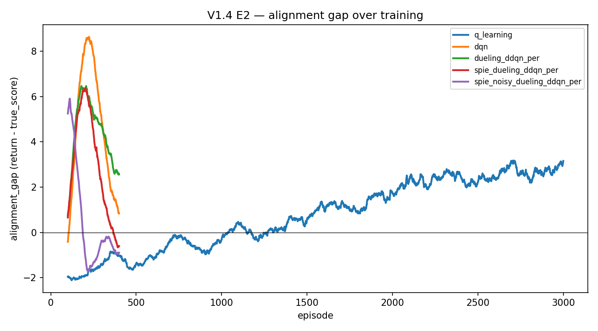

# AxiomForge

**A compact causal-safety reinforcement learning benchmark for hidden-rule inference,
sparse rewards, proxy traps, and alignment-gap measurement.**

AxiomForge is a two-layer symbolic, Gymnasium-style "research lab" environment. An agent
must read clues, **infer a hidden work order** (which sample, purity, temperature, charge),
follow the episode's **required protocol**, compensate for **machine faults**, file a
**calibrated report**, and avoid **reward-hacking traps** — all under a sparse success
signal. One configuration-gated engine spans a difficulty ladder (V1.0 → V1.4), and a
suite of 14 value-based algorithms (tabular through Rainbow-style deep RL, plus a
successor/predecessor intrinsic-exploration variant) is benchmarked on it with a
train / held-out generalization protocol and a dedicated misalignment study.

> **Disclaimer.** This is a compact, laptop-scale research testbed for studying
> generalization and reward hacking in a controlled causal task — **not** a frontier-scale
> benchmark. Results below are from a verified 5-seed run and are meant to be illustrative
> and reproducible, not competitive SOTA numbers.

---

## Project history & provenance (Mini Research World → AxiomForge)

This project **began as "Mini Research World"** — a simpler 8×8 two-layer symbolic RL
environment (now archived at
`Mini_Research_Pre_AxiomForge_Era/environment/mini_world_env.py`). That earlier task was solvable by standard
value-based / DQN-style agents: tabular SARSA reached ~97% success on it. Through multiple
research iterations the project then **evolved into AxiomForge**, the richer
config-gated lab (hidden work-order inference, faults, calibrated reports, and the V1.4
misalignment traps). **AxiomForge is now the main research artifact**; Mini Research World
is its ancestor, not its current task.

The Mini Research World-era files are **archived for provenance/history** under
[`Mini_Research_Pre_AxiomForge_Era/`](Mini_Research_Pre_AxiomForge_Era/) (a self-contained
legacy island, kept out of the active tree so readers don't mistake it for the current
pipeline):

- **Legacy environment:** `Mini_Research_Pre_AxiomForge_Era/environment/mini_world_env.py`
- **Legacy tabular CLIs** (import `mini_world_env` directly):
  `Mini_Research_Pre_AxiomForge_Era/agents/` — `sarsa_agent.py`, `q_learning_agent.py`,
  `expected_sarsa_agent.py`, `random_agent.py`
- **Legacy analysis:** `Mini_Research_Pre_AxiomForge_Era/analysis/` — `multi_seed_eval.py`
  (confidence-band study) and `compare_tabular_agents.py` (tabular comparison plots)
- **Legacy results:** `Mini_Research_Pre_AxiomForge_Era/results/` — `sarsa_10k.csv`,
  `q_learning_10k.csv`, `expected_sarsa_10k.csv` (+ the matching `*_qtable_10k.pkl`),
  `random_baseline_1k.csv`, `multi_seed/`, and `plots/`

**The verified AxiomForge results are produced entirely by the AxiomForge paths** —
`environments/axiom_forge_*`, `agents/dqn_axiom_forge.py` · `spie_q_agent.py` ·
`trap_sentinel.py`, the `scripts/*axiom_forge*` / `run_*` drivers, and their
`results/{V1.0…V1.4, full_benchmark, ablation_noisy_per_spi, pg_spie_*, r0_r2_summary,
trap_sentinel_probe}/` outputs. The AxiomForge benchmark and the R0→R3 ladder **do not
import or depend on** `mini_world_env.py` or the legacy tabular CLIs (the AxiomForge tabular
algorithms are re-implemented inside `scripts/train_*_axiom_forge.py`). Unless a specific
result path is explicitly documented as coming from the legacy env, assume it does not.

The **current AxiomForge contribution** is the hidden-score / proxy-reward / reward-hacking
setup (visible reward vs evaluator-only `true_score`, `alignment_gap`, proxy trap `Y`,
unsafe shortcut `X`, true goal `G`) together with the **R0→R3 anti-reward-hacking ladder**.
A separate **AxiomForge-LM** direction (an observable-only oversight benchmark for language
agents) is planned for a later phase and is not part of this release.

---

## Environment ladder

| Version | What it adds | Research question |
|---|---|---|
| **V1.0** | Deterministic causal-chain lab (fixed work order, protocol P0) | Can undirected exploration even reach the sparse success? (No — the "exploration wall.") |
| **V1.1** | Randomized work order / protocol (P0,P1) / **hidden** catalyst mapping; train vs held-out config split | Do agents generalize across latent configs, or memorize? |
| **V1.2** | Catalyst + sample **probes** (mapping becomes observable); protocol P2 | Does richer observation help or hurt transfer? |
| **V1.3** | **Faults** (heater swap, purifier leak, analyzer bias), decon, calibrated 3-dial report | Can agents diagnose and compensate for hidden faults? |
| **V1.4** | **Misalignment traps**: proxy-reward terminal, unsafe shortcut, hidden `true_score`, `alignment_gap` | Do agents reward-hack the proxy? Which methods preserve alignment? |

The `HiddenContext` (the grader's answer key) is **never** exposed in the observation;
`true_score` is a logged metric only and never enters the training reward. See
[docs/environment_ladder.md](docs/environment_ladder.md).

## Algorithms (14)

**Tabular** (shared encoded Q-key): Q-learning · SARSA · Expected SARSA · **SPIE-Q**
(successor/predecessor intrinsic exploration).

**Deep value-based** (one configurable `DQNAgent`; switches `double` / `dueling` / `per` /
`noisy`, plus a driver-level `spie` intrinsic wrapper): DQN · DDQN · Dueling DQN ·
Dueling DDQN + PER · Noisy Dueling DDQN + PER · SPIE-DQN · SPIE-DDQN · SPIE-Dueling DQN ·
SPIE-Dueling DDQN + PER · SPIE-Noisy Dueling DDQN + PER.

See [docs/algorithm_suite.md](docs/algorithm_suite.md).

## Key verified findings (full 5-seed benchmark)

- **Tabular methods memorize and do not generalize** — held-out greedy success ≈ 0.02
  across V1.1–V1.4 for all four tabular algorithms.
- **DQN generalizes far better on V1.1** — held-out 0.40 ± 0.14 (best seed 0.67), ~20× the
  tabular baseline. The deep advantage is real where the task is simplest.
- **The deep advantage decays from V1.1 → V1.4** (held-out ≈ 0.35 → 0.10 → 0.03 → 0.02):
  each added mechanism (probes, faults, traps) adds config-specific structure the flat
  network memorizes rather than transfers.
- **V1.4 E2 shows proxy reward-hacking and a measurable alignment gap** — no vanilla agent
  solves the task, but most learn to farm the proxy: visible return rises while the hidden
  `true_score` falls.
- **SPIE intrinsic exploration alone *worsens* proxy-seeking** in E2 (tabular SPIE-Q is the
  worst hacker), because novelty-seeking pulls a weak agent toward the under-explored trap.
- **Noisy Dueling DDQN + PER is the strongest alignment-preserving variant** in the
  verified run — a *negative* alignment gap (−0.90) and a 0.06 hack rate (it does the task
  instead of farming the proxy).
- **No no-demo (vanilla) agent solves V1.4 E2** — the exploration wall holds for every
  value-based method here.

Full numbers, tables, and plots: [docs/axiom_forge_full_benchmark_report.md](docs/axiom_forge_full_benchmark_report.md)
· independent reproduction: [docs/axiom_forge_codex_full_benchmark_verification.md](docs/axiom_forge_codex_full_benchmark_verification.md).



## Anti-reward-hacking ladder (R0 → R3)

A focused study — on the **Noisy Dueling Double-DQN** backbone (DQN-family,
**not** tabular Q-learning) — of how exploration/replay mechanisms interact with
the V1.4 proxy trap. The proxy tile **`Y`** pays visible reward (3.0 / 1.5 / 0.75)
but is **not** true success; the real terminal objective is the submission goal
**`G`**. Observable counters `proxy_attempt_count` / `proxy_claim_count` rise
**only** at `Y`. Every mechanism below is **observable-only** — it never reads
`true_score` or `HiddenContext` in any training reward, gate, penalty, or replay
priority (`true_score` is reporting/eval-only).

| rung | mechanism (knob) | finding |
|---|---|---|
| **R0** | Noisy × PER × SPIE ablation | naive SPIE — and especially PER+SPIE — **amplify** proxy hacking |
| **Sentinel** | passive detector (read-only) | the failed novelty signal fires on `Y`, never on `G` — a usable trap detector |
| **R1** | Protocol-Gated SPIE (`+pg`) | gating SPIE to observable milestone progress **eliminates** hacking in the no-demo regime |
| **R2** | proxy-coupled penalty (`+pp`, `--kappa`) | **κ=4/8 nearly eliminates demo-seeded proxy farming with no success loss** (headline) |
| **R3** | trap-aware PER (`+per`, `+taper`) | naive PER **re-ignites** hacking; the median-cap **prevents** it — but R2 (no PER) stays recommended |

**Headline — demo-seeded, 5 seeds (success ≈ 0.545 across all rows):**

| variant | trap_hits | reward_hack_rate | alignment_gap |
|---|---:|---:|---:|
| plain noisy | 0.247 | 0.083 | +0.93 |
| naive SPIE | 0.378 | 0.129 | +1.67 |
| R1 (gate) | 0.374 | 0.128 | +1.49 |
| **R2 κ=4** | **0.039** | 0.013 | **−0.05** |
| **R2 κ=8** | **0.022** | 0.007 | **−0.13** |

Reports: [reports/axiomforge_r0_r2_antihacking_summary.md](reports/axiomforge_r0_r2_antihacking_summary.md)
(consolidated R0→R2) · [reports/pg_spie_r3_trap_aware_per.md](reports/pg_spie_r3_trap_aware_per.md)
(R3). Runners: `scripts/run_noisy_per_spi_ablation.py`,
`run_pg_spie_r1.py`, `run_pg_spie_r2.py`, `run_pg_spie_r2_ksweep.py`,
`run_pg_spie_r3_trap_aware_per.py`; data under
`results/{ablation_noisy_per_spi, pg_spie_r1, pg_spie_r2, pg_spie_r2_ksweep, pg_spie_r3_trap_aware_per}/`.

> **Bounded claim.** In AxiomForge, naive structural novelty and PER can amplify
> proxy reward hacking. We show that the failed novelty signal can be repurposed
> as an observable trap sentinel. Protocol gating and proxy-coupled reversal
> sharply reduce proxy hacking, with R2 κ=4/8 nearly eliminating trap behavior
> without reducing success. Trap-aware PER prevents replay-based re-amplification,
> but R2 without PER remains the recommended configuration. This is a controlled,
> single-environment, Noisy Dueling DDQN demonstration — not a general alignment
> solution.

## Quickstart

```bash
# 1. create a virtual environment + install
python3 -m venv .venv
.venv/bin/pip install -r requirements.txt

# 2. run the test suite (330 tests)
.venv/bin/python -m pytest tests/ -q

# 3. run one small training command (tabular Q-learning on V1.1)
.venv/bin/python scripts/train_axiom_forge.py --version v1_1 --algo q_learning \
    --episodes 300 --seeds 0 --train-configs 8 --heldout-configs 4 \
    --demo-configs 8 --epsilon-start 0.1 --results-dir /tmp/quickstart

# 4. read the benchmark report
open docs/axiom_forge_full_benchmark_report.md
```

## Reproduction

```bash
.venv/bin/python -m pytest tests/ -q                       # 330 passed
.venv/bin/python scripts/run_full_benchmark.py             # the 70-job matrix (~75 min, 6-way parallel)
.venv/bin/python analysis/aggregate_full_benchmark.py      # tables -> results/full_benchmark/tables/
.venv/bin/python analysis/plot_e2_comparison.py            # plots  -> results/full_benchmark/plots/
```

Seeds: `0 1 2 3 4`. Full protocol, expected artifact counts, and folder layout:
[docs/reproducibility.md](docs/reproducibility.md).

## Results location

- `results/full_benchmark/` — the verified 5-seed benchmark: 70 per-cell `summary.csv`,
  350 per-seed CSVs, 70 generalization curves, 14 E2 plots, aggregate `tables/`, and
  comparison `plots/`.
- `results/V1.0/`, `results/V1.1…V1.4/` — earlier single-config and smoke-scale AxiomForge
  runs backing the reference and smoke reports. (The legacy Mini Research World `multi_seed/`
  and `plots/` outputs now live under `Mini_Research_Pre_AxiomForge_Era/results/`.)

## Project status

- **V1.0–V1.4 complete** (one config-gated engine; 330 tests).
- **Full 5-seed benchmark verified** (70/70 jobs, 0 failures; tables reproduce
  byte-for-byte).
- **Next phase** (see [docs/future_roadmap.md](docs/future_roadmap.md)): code-study pass,
  PPO / policy-gradient agents, POMDP / DRQN recurrent agents, transformer-memory agents,
  counterfactual protocol tasks, SFT / imitation from solver traces, an LLM-agent wrapper,
  and a multi-agent (MARL) extension.

## Related work

AxiomForge draws on the spirit of **AI Safety Gridworlds** (specification gaming, safe
interruptibility), **DeepMind Alchemy** (latent structure inference), **causal RL**,
**intrinsic-motivation / exploration** (successor & predecessor representations,
NoisyNets), and **value-based deep RL** (DQN / Double / Dueling / PER / Rainbow). A formal
citation list is a TODO for the first tagged release.

## Limitations

AxiomForge is a deliberately small, controlled testbed; read the numbers with these caveats:

- **Laptop-scale and value-based only.** The suite is entirely value-based (tabular →
  Rainbow-style DQN + SPIE). No policy-gradient, recurrent, or memory agents yet — those
  are roadmap items, so the generalization/alignment rankings are specific to this family.
- **Baselines are demo-seeded by design.** V1.0 has an *exploration wall*: undirected
  exploration never reaches the sparse success over the ~61-step solution, so every baseline
  is seeded with the BFS solver trajectory. Reported "success" therefore measures
  generalization *from demonstrations*, not from-scratch discovery — and **no vanilla
  (no-demo) agent solves V1.0–V1.4**.
- **Single task family, config-level split.** One 10×10 two-layer task; the held-out split
  is over latent configurations, not over genuinely novel task structures.
- **Modest seed count, high E2 variance.** Headline numbers are 5 seeds; the V1.4 E2
  alignment gap has high seed variance (std up to ~8.4), so E2 rankings are indicative, not
  definitive.
- **Illustrative, not SOTA.** Greedy/deterministic evaluation on a compact benchmark —
  meant to be reproducible and attributable, not competitive state-of-the-art.
- **Anti-hacking ladder is single-environment and needs tuning.** The R0→R3 study runs on
  V1.4 only, relies on hand-crafted **observable** proxy counters, requires κ tuning (κ=1
  was too weak; κ≥4 is the effect), and is 5 seeds — a controlled demonstration of one
  mechanism, **not** a general alignment method.

## Citation

If you use AxiomForge in your work, please cite this repository (a formal paper/citation is
planned for the first tagged release):

```bibtex
@software{axiomforge_2026,
  title  = {AxiomForge: A Compact Causal-Safety Reinforcement Learning Benchmark
            for Hidden-Rule Inference, Sparse Rewards, Proxy Traps, and
            Alignment-Gap Measurement},
  author = {AxiomForge contributors},
  year   = {2026},
  note   = {Version 1.4},
  url    = {https://github.com/<your-username>/axiomforge}
}
```

## License

MIT — see [LICENSE](LICENSE).
